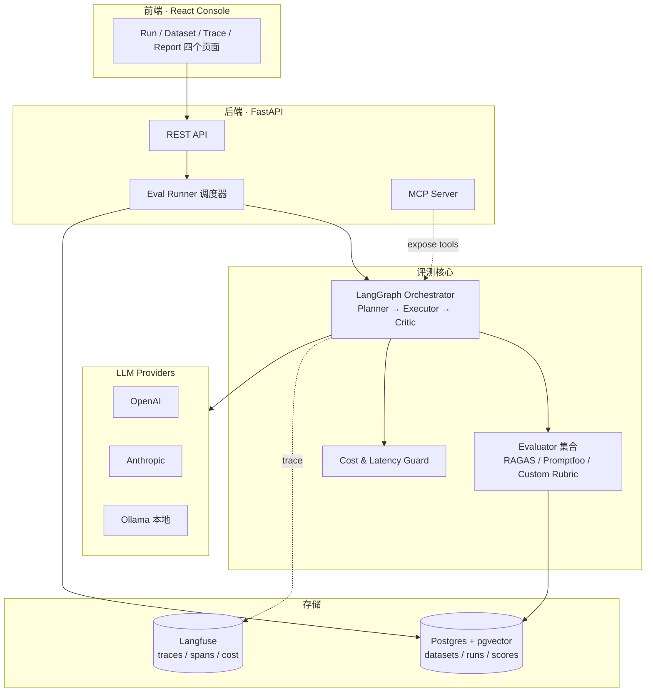

# 阶段 2 代表作项目架构 · EvalForge

> **一句话定位**：一个面向 LLM 应用 / Agent 的「评测 + 可观测 + 成本治理」一体化平台，把我在微软 Core AI Team 做的事开源化、产品化。
>
> **为什么是它**：直接复用现职最稀缺的"评测体系设计"经验 → 转化为可对外展示的代码资产 → 同时覆盖招聘市场最关心的 Agent / RAG / Eval / Observability 四个关键词。

---

## 1. 目标与非目标

### 1.1 目标用户

- 中小团队的 LLM 应用开发者：用了 Dify / LangChain / 自研 Agent，但**没有系统化评测和成本监控**。
- 求职者本人：作为简历最上方的"代表作"，需要**架构清晰、Demo 可跑、指标可量化**。

### 1.2 核心场景（MVP）

1. 接入一个 LLM Agent（自带的 Demo Agent 或用户自己的 Endpoint）。
2. 上传一份评测数据集（CSV / JSONL）。
3. 一键运行评测，得到 Faithfulness / Relevance / Cost / Latency / Custom Rubric 五项指标。
4. 在 Dashboard 上看到每一次 Run 的对比、Trace 详情、Token 成本曲线。
5. 把评测结果导出为 HTML 报告，可贴到 PR 或周报里。

### 1.3 非目标（第一版不做）

- ❌ 模型训练 / 微调（阶段 3 单独做，**不要混进来**）
- ❌ 多租户、计费、企业 SSO（产品化的事，简历不需要）
- ❌ 自研向量库 / 自研 LLM Gateway（直接用现成的）

---

## 2. 技术选型与理由

| 层            | 选型                                                   | 理由                                                            |
| ------------- | ------------------------------------------------------ | --------------------------------------------------------------- |
| Agent 编排    | **LangGraph**                                          | 2026 年面试高频，比 LangChain 更结构化，状态机模型适合做 Demo   |
| LLM Provider  | OpenAI + Anthropic + Ollama（本地）                    | 多供应商对比是评测平台的题中之义                                |
| 评测库        | **RAGAS + Promptfoo + DeepEval**                       | RAGAS 做 RAG 三件套，Promptfoo 做回归，DeepEval 做 LLM-as-Judge |
| Observability | **Langfuse**（自部署 docker-compose）                  | 强烈推荐写在简历上，trace + cost + scoring 一体                 |
| 向量库        | **pgvector**                                           | 一个 Postgres 解决"业务库 + 向量库"，运维零负担                 |
| 后端          | FastAPI + SQLModel + uv                                | Python 生态原生，async 友好                                     |
| 前端          | React 18 + Vite + Ant Design X + TanStack Query        | 完全复用我的现有技术栈，**不浪费学习时间**                      |
| 部署          | Docker Compose（自部署） + Vercel（前端 Demo）         | 简单可复现，README 一条命令起                                   |
| CI/CD         | GitHub Actions（lint / typecheck / pytest / 自动评测） | 顺便展示工程化能力                                              |
| MCP           | 实现 1 个 MCP Server 暴露评测能力                      | 蹭 2026 年最热协议                                              |

---

## 3. 系统架构（C4 Level-2）



---

## 4. 关键模块设计

### 4.1 Agent Orchestrator（LangGraph）

```text
State = {
  task: str,
  dataset_row: dict,
  plan: list[Step],
  trace: list[ToolCall],
  cost_usd: float,
  result: str | None,
  scores: dict | None,
}

Nodes:
  planner   → 拆解任务，输出 Step 列表
  executor  → 执行 Step（可调用 tools / sub-agent）
  critic    → LLM-as-Judge 自评 + 决定是否重试
  finalizer → 收敛输出，写 trace
Edges:
  planner → executor
  executor →(loop)→ critic
  critic →(retry?)→ executor | finalizer
```

**为什么是 Planner-Executor-Critic**：这是 2026 年 Agent 论文里最常被引用的三件套，面试官一看就懂；同时复用了 Core AI Team「评测 → 发现 → 优化」的循环思想。

### 4.2 Evaluator Pipeline

```text
Run 触发 → 拉取 Dataset → 并发 N 路调用 Agent →
  ├─ RAGAS：Faithfulness / Answer Relevance / Context Recall
  ├─ Promptfoo：基于断言的回归（exact / contains / similar / llm-rubric）
  ├─ Custom Rubric：复用 Core AI Team 的 5 维度评分
  └─ Cost & Latency：从 Langfuse 拉成本与 P50/P95
→ 写入 scores 表 → 触发 Report 生成
```

**双引擎策略**：RAGAS 解决"质量"，Promptfoo 解决"回归"，自研 Rubric 解决"业务相关性"。三者互不重叠，覆盖完整。

### 4.3 Cost & Latency Guard

- 每个 Run 有 `budget_usd` 与 `timeout_s`，超阈值自动 abort，写一条 `aborted_reason`。
- 在 Dashboard 上对比"Run-A 比 Run-B 提升 5% 准确率，但成本翻倍"——这种洞察才是评测平台的真实价值。

### 4.4 MCP Server（加分项）

暴露三个工具：`run_eval` / `get_report` / `compare_runs`，让 Claude Desktop / Cursor 能直接调用 EvalForge。**这一项就是简历差异化**。

---

## 5. 数据模型

```sql
datasets       (id, name, schema_json, created_at)
dataset_rows   (id, dataset_id, input_json, expected_json)
agents         (id, name, provider, model, config_json)
runs           (id, agent_id, dataset_id, status, budget_usd, started_at, finished_at)
run_outputs    (id, run_id, row_id, output_text, cost_usd, latency_ms, trace_id)
scores         (id, run_id, metric, value, rubric_json)
```

刻意保持小，**6 张表覆盖整个 MVP**。

---

## 6. 里程碑（对齐 16 周计划 Week 5–10）

| 周  | 里程碑                | 验收标准                                    |
| --- | --------------------- | ------------------------------------------- |
| W5  | 立项 + 脚手架         | README v0、CI 跑通、架构图入仓              |
| W6  | Orchestrator 跑通     | 5 个端到端用例从 planner 走到 finalizer     |
| W7  | Evaluator 上线        | 一份真实 Eval Report（HTML + JSON）能跑出来 |
| W8  | Langfuse + Cost Guard | Dashboard 截图能放进 README                 |
| W9  | 前端控制台            | Demo 可访问，能完整跑一次 Run               |
| W10 | 发布                  | 博客 + 视频 + 多渠道发声                    |

---

## 7. 简历呈现话术（直接可贴）

> **EvalForge · LLM 应用评测与可观测开源平台**（个人项目，[GitHub 链接])
>
> - 独立设计并实现面向 LLM Agent 的端到端评测平台，覆盖**质量 / 成本 / 延迟**三类指标。
> - 基于 **LangGraph** 实现 Planner-Executor-Critic 三节点 Agent 循环，State 机驱动 + checkpoint 持久化。
> - 集成 **RAGAS + Promptfoo + 自研 Rubric** 三引擎评测，复用微软 Core AI Team 的 5 维度方法论。
> - **Langfuse** 全链路 trace + cost 监控，实现单 Run 预算守门（budget_usd / timeout_s）。
> - 实现 **MCP Server** 暴露评测能力，可被 Claude Desktop / Cursor 直接调用。
> - 配套技术博客全网阅读 N+，GitHub star N+。

---

## 8. 风险与回滚

| 风险                     | 触发条件                      | 回滚方案                                               |
| ------------------------ | ----------------------------- | ------------------------------------------------------ |
| LangGraph 学习曲线超预期 | Week 6 末跑不通三节点         | 降级为 LlamaIndex Workflow / 纯 Python 状态机          |
| 多 LLM Provider 成本失控 | Week 7 后 OpenAI 月账单 > $30 | 评测主体切到 Ollama 本地 + GPT-4o-mini 仅做 Judge      |
| 前端工作量挤压评测核心   | Week 9 中 Runner 还有 bug     | 砍 Trace 详情页，只保留 Run 列表 + Report              |
| Demo 部署复杂            | Week 10 部署超 1 天           | 砍线上 Demo，README 放本地 docker-compose 一键脚本即可 |

---

## 9. 检查清单（结项才算完成）

- [ ] Public GitHub 仓库，README 含架构图 / Quick Start / Demo GIF
- [ ] 一条命令 `docker compose up` 可本地启动
- [ ] 至少 1 个真实评测案例（用 Sales Genie 或 TB2 数据脱敏）
- [ ] 1 篇配套技术博客，3 个渠道发布
- [ ] CI 绿灯，测试覆盖率 ≥ 60%
- [ ] 简历更新到 v3，加上 EvalForge 段落
